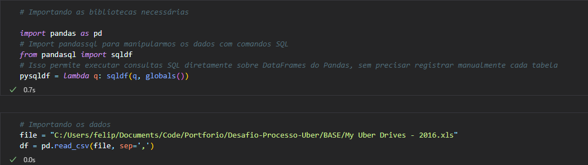
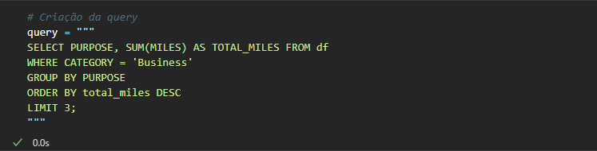
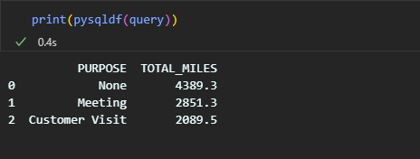

# Desáfio de processo seletivo da Uber
Este projeto simples tem como objetivo a resolução de um desafio do processo seletivo para análista de dados Junir dentro da uber. E tem o seguinte requisito:

* Você recebe uma tabela de corridas do UBER que contém a quilometragem e o objetivo da despesa comercial. Você é solicitado a encontrar objetivos comerciais que gerem o maior número de milhas percorridas para passageiros que usam o Uber para transporte Comercial. Encontre as 3 principais categorias finalidade comercial por quilometragem.

## Principais tecnologias
Python(Pandas, Pandasql) - Criação e maniopulação de Dataframe utilizando comandos SQL

## Passos da resolução
* Importação de base e bibliotecas e configuração base para utilizar comandos SQL
  

* Criação de nossa query utilizando comandos SQL, poss[ivel graças a biblioteca pandasql
  

* Resultado final da nossa query trazendo o que foi pedido na resolução de nosso desafio técnico.
  

## Conclusão
Este foi apenas um pequeno projeto com o intuito de estar simulando uma demanda real, este e um dos desafios propostos no processo seletivo da uber.
